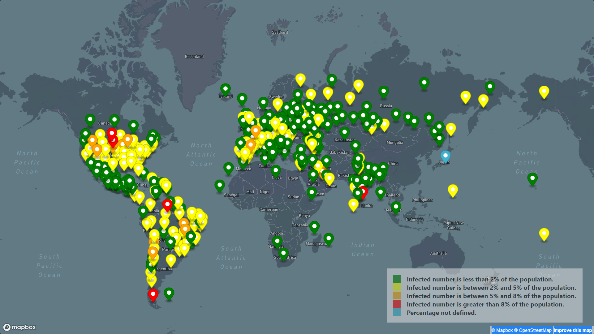
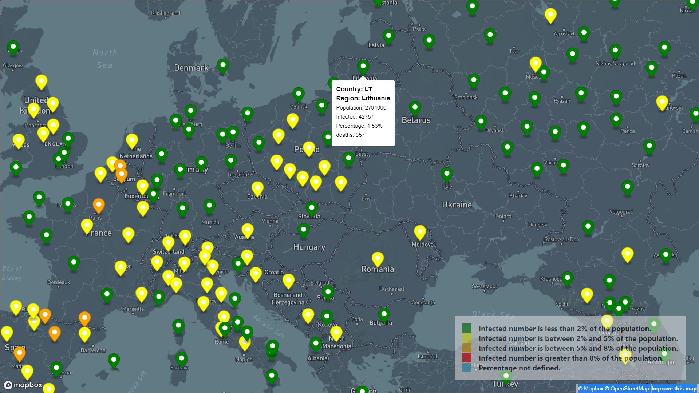

# Corona Mapbox

### Table of Contents

Sections headers will be used to reference location of destination.

- [Description](#description)
- [How To Use](#how-to-use)
- [License](#license)
- [Author Info](#author-info)

---

## Description

I built this simple app that uses the mapbox API (so powerful and the docs are so easy to read) and that creates a marker with a different color for each country/region, depending on the percentage of cases.
The data used to populate this map is from a local static file, since the API is not free.
To get the data I just inspected the website coronavirus.app/map and looked in network for GET requests, once I found the object with all the places I stored it as a global variable, copied it with copy(JSON.stringify(data)) and saved it in my project as a .json file to be able to fetch it locally.

#### Technologies

- HTML5
- CSS3
- Vanilla JS

[Back To The Top](#book-scanner-web-app)

---

---

#### API Reference

[MapBox API](https://docs.mapbox.com/mapbox-gl-js/api/)

---

## License

MIT License

Copyright (c) [2020] [Zakaria Mofaddel]

Permission is hereby granted, free of charge, to any person obtaining a copy
of this software and associated documentation files (the "Software"), to deal
in the Software without restriction, including without limitation the rights
to use, copy, modify, merge, publish, distribute, sublicense, and/or sell
copies of the Software, and to permit persons to whom the Software is
furnished to do so, subject to the following conditions:

The above copyright notice and this permission notice shall be included in all
copies or substantial portions of the Software.

THE SOFTWARE IS PROVIDED "AS IS", WITHOUT WARRANTY OF ANY KIND, EXPRESS OR
IMPLIED, INCLUDING BUT NOT LIMITED TO THE WARRANTIES OF MERCHANTABILITY,
FITNESS FOR A PARTICULAR PURPOSE AND NONINFRINGEMENT. IN NO EVENT SHALL THE
AUTHORS OR COPYRIGHT HOLDERS BE LIABLE FOR ANY CLAIM, DAMAGES OR OTHER
LIABILITY, WHETHER IN AN ACTION OF CONTRACT, TORT OR OTHERWISE, ARISING FROM,
OUT OF OR IN CONNECTION WITH THE SOFTWARE OR THE USE OR OTHER DEALINGS IN THE
SOFTWARE.

[Back To The Top](#book-scanner-web-app)

---

## Author Info

- LinkedIn - [Zakaria Mofaddel](https://www.linkedin.com/in/zakaria-mofaddel-171351181/)
- Portfolio - [Zakaria Mofaddel](https://zakariamofaddel.netlify.app/)

[Back To The Top](#book-scanner-web-app)
